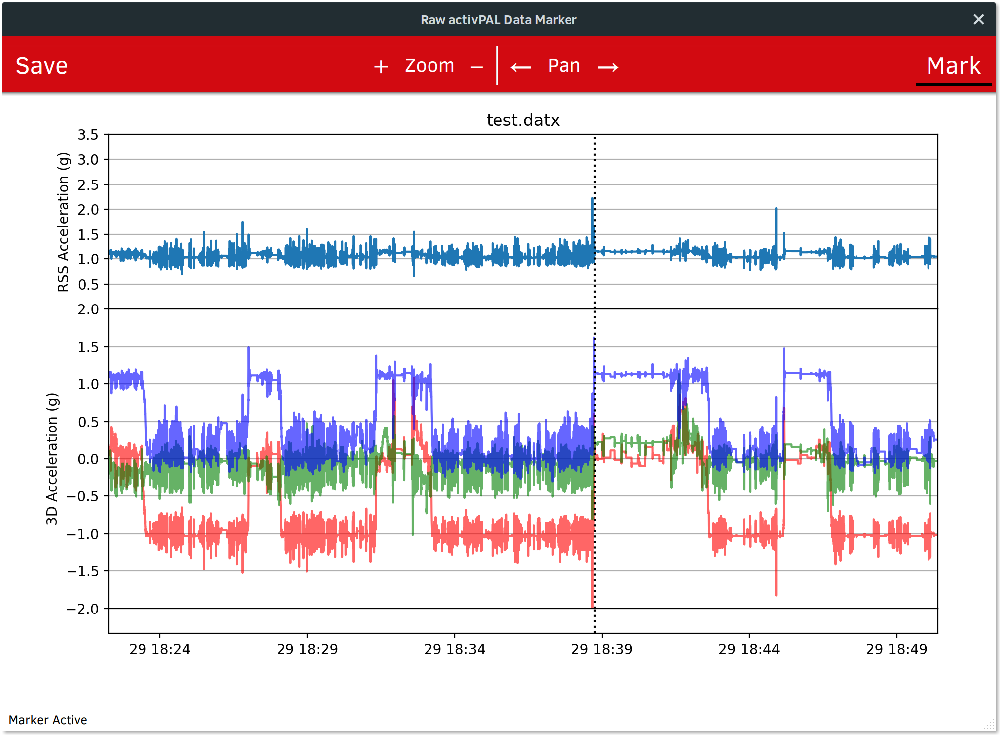

# python-uos-activpal
[](https://travis-ci.org/R-Broadley/python-uos-activpal)
[](https://github.com/R-Broadley/python-uos-activpal)
[](https://github.com/R-Broadley/python-uos-activpal/blob/master/LICENSE)


A python package for working with data from activPAL devices.


## Installation
```pip install uos_activpal```

## Subpackages

### IO
Contains classes and functions for loading activPAL data files.
Some modifications to the data files are possible e.g. to change the file code (commonly used as participant ID).

#### Raw
The module for working with the raw signal data (.dat or .datx files). It should be fast as it uses Numba to JIT compile key functions.

The function load_activpal_data takes the path to a file as the input and returns a tuple containing metadata and a NumPy array with one column for each axis of the sensor.

Call Signature: ```meta, signals = load_activpal_data(file_path)```.

The class activpal_data makes it easier to work with the data by providing useful functions as methods.

```activpal_data.signals``` returns a DataFrame containing the signals.

```activpal_data.timestamps``` returns the timestamps.

```activpal_data.x``` returns a the x axis signal as a Series, replace x with y or z for the other axes.

```activpal_data.rss``` returns the root sum of squares of x, y, z.

Call Signature: ```activpal_data = activpal_data(file_path)```.


### GUI
Contains modules for building GUIs to interact with activPAL data. 

#### Base
A module which contains base classes for GUI application development. The other modules in GUI build upon the base module classes.

#### Raw Viewer
Contains classes for building applications for viewing the raw data.

The module contains a working example which allows interactively loading data files and inspecting them.

To run this application use: ```python -m uos_activpal.gui.raw_viewer```.


#### Raw Marker
Contains classes for building applications for marking points in the raw data and saving the sample number and timestamp.

The module contains a working example (screenshot below) which allows interactively loading data files, marking points and saving them to file.

To run this application use: ```python -m uos_activpal.gui.raw_marker```.




## Disclaimer
This package is free software: you can redistribute it and/or modify it under the terms of the GNU General Public License version 2, as published by the Free Software Foundation. This package is distributed in the hope that it will be useful, but WITHOUT ANY WARRANTY; without even the implied warranty of MERCHANTIBILITY or FITNESS FOR A PARTICULAR PURPOSE. See the GNU General Public License version 2 for more details. A copy of the General Public License version 2 should be included with this toolbox. If not, see https://www.gnu.org/licenses/gpl-2.0.html.